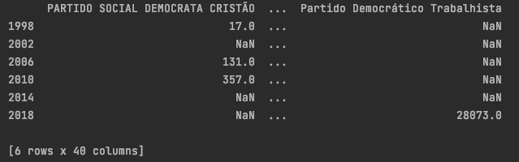
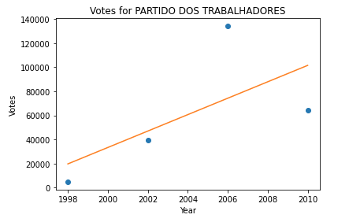
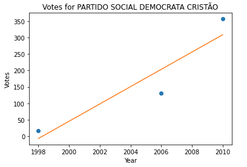

## Team 2: Deliverable 1 - Brazilian Immigrant Participation in Brazil-Held Election Results

## Checklist
- [x] Collect and pre-process a preliminary batch of data
- [x] Perform a preliminary analysis of the data
- [x] Answer two key questions
- [x] Refine project scope and list of limitations with data and potential risks of achieving project goal
- [x] Submit a PR with the above report and modifications to original proposal

---
## Initial Questions Answered and Results

### Question 1: How have voting patterns changed over time?

Our team has begun our initial analysis of the data to answer the question of how has voting patterns changed over time. This initial analysis started with extracting the all the unique political parties from every 
year of our data set, summing their total received votes and creating a new dataframe with its columns being the political parties and each row split by election data year and filled with their total summed votes.

We then proceeded to model each political party and their summed votes over each year that they were a part of. Here are two example models:

    

As seen in our modeling, the shift in voting patterns over time for each political party is generally trending upwards, with the exception of a few.  Although, not all political parties have voting data across the 
years 1998, 2002, 2006, 2010, 2014 and 2018. For those who have voting data across 2 or more years, we were able to model a least squares polynomial fit to gage a general upwards or downwards trend. *In the final 
report, we will list the voting models separated by upwards and downwards trends as long as voting data for a political party spans across 2 or more years.

### Question 2: What are some social-political activities that have influenced voting patterns? Which factors appear to be the most impactful? 

To answer this question on the impact of social-political activities, our team started by congregating all the major events in Brazil from 1998 to 2018. This list held events such as the election of a president, 
outbreak of a virus, launch of a welfare scheme, etc. Later as we develop more advanced models with more specific features, we can then use our list of events as correlation factors. 

###Major events in Brazil (1998 - 2018) (https://www.bbc.com/news/world-latin-america-19359111)
####1998 October - President Cardoso re-elected
####2002 October - Luiz Inácio Lula da Silva, popularly known as Lula, wins presidential elections to head the first left-wing government for more than 40 years.
####2005 June-August - Corruption allegations rock the governing Workers' Party. A wave of resignations ensues.
####2006 October - President Lula is re-elected.
####2010 October - Dilma Rousseff, of President Lula's Workers' Party, wins second round run-off to become Brazil's first female president.
####2011 June - Government launches Brasil Sem Miseria (Brazil Without Poverty) welfare scheme, aimed at lifting millions out of extreme poverty.
####2013 June - A wave of protests sweeps the country. People take to the streets in dozens of cities to demonstrate over poor public services, rising public transport costs and expense of staging the 2014 World Cup. The protests continue into the autumn.
####2014 October - Dilma Rousseff wins another term as president.
####2016 February - World Health Organisation declares a global public health emergency following an outbreak of the Zika virus centred on Brazil.
####2016 August - Olympic Games are held in Rio de Janeiro.
####Senators vote to remove President Dilma Rousseff from office for illegally using money from state banks to bankroll public spending. Michel Temer is sworn in to serve the rest of her term to 1 January 2019.
####2018 April - Former president Lula da Silva is imprisoned for corruption, which makes him ineligible to run for president in October.
####2018 October - Far-right candidate Jair Bolsonaro wins presidential election over Workers' Party candidate, takes office in January 2019.

With this list of major events and as seen in our modeling, the general upward trend of voting means Brazilians have become more politically active overseas. This activism can be traced back to Brazil where people were also active in politics. 
Corruption allegations, protests, the 2014 World Cup, and outbreak of the Zika virus were important events captured throughout our time frame. These events would impact voter turnout because Brazilians away from 
home want to help direct their country through these challenges.

2018 was a popular year for voting across all parties. This was caused by the major political events impacting that voting year. President Dilma Rousseff and former President Lula da Silva were in trouble from 
corruption, making an opportunity for other parties to get their candidate elected. This opportunity led to a huge voter turn out from overseas in order to promote their party’s candidate.

---

## Refined Project Proposal

### Title: Brazilian Immigrant Participation in Brazil-Held Election Results

## Team Members
- Chen Feng (cefeng9988)
- Marco Raigoza (marco-raigoza)
- Wangkai Zhu (wzhu8410)
- Jiaru Li (Jiaru-Li)

## Project Description
This project seeks to understand voting patterns of Brazilian immigrants in Brazil elections and the composition of the Brazilian immigrant electorate. By analyzing the election data, we hope to understand changing patterns among Brazilian immigrants that vote in Brazilian elections by analyzing how Brazilians in different countries and social-political activities have influenced voting patterns.

Pending the success of Brazilian data analysis, look at similar patterns and trends for Haitan Immigrants and Haiti-held elections as well as Dominican Republic Immigrants and Dominican Republic-held elections.

Contextual Note: Immigrants living in the US (or outside their home country) can still vote in national elections.

## Data Sets
For our project, we have been given 2 main datasets, each with 6 separate files (excel worksheets). The first dataset contains demographic data on Brazilian immigrant voters for the years 1998, 2002, 2006, 2010, 2014, and 2018. The second dataset contains voting records for Brazilian immigrant voters for the same years.
Our team (Team 2) is working closely with the election data and analyzing voting trends, changes in voting pattern and how voters from different countries vote differently.

## Plan for Data Set Cleaning
At this stage, the main cleaning task will be reconciling pre-2010 datasets with post-2010 datasets as there are missing, incomplete, or inconsistent values across the datasets:

-Prior to 2010, the municipality code (location of voter) feature only identified the country of the voter. However, after 2010, the codes were updated to identify the region within a country of the voter. In order to compare data from all years, we will need to develop a mapping function to reconcile the codes for the pre-2010 and post-2010 datasets.

## Plan for Answering Strategic Questions
To begin, we will clean the datasets. For the voting records dataset, we will look at how voting patterns — popularity of political parties and voter turnout — have changed over time as well as differences in voting patterns between countries the electorate votes from. 

## Key Questions to be Answered
Our team will use the election data to answer as many of the questions below as possible.
- How have voting patterns changed over time
- What are some social-political activities that have influenced voting patterns? Which factors appear to be the most impactful?
- How are voting patterns different among Brazilian immigrants residing in different countries (eg, US vs Japan)?
- How have voting trends changed as the demographics of the electorate (voters) have changed?

## Limitations
- There appears to be some variance in how "location" (or municipality) of voters is defined in the different datasets (for example, the 1998 dataset appears to only identify the countries in which voters live, but later datasets break down this data into major cities/regions within a country). Likely, we should be able to resolve these differences through some data cleaning, but it is worth noting.
- This is very minor, but some of the earlier datasets contain entries from countries which have since been renamed or split into multiple countries (eg, Yugoslavia). We will need to figure out how to deal with these entries as we analyze trends over time.
- We have been advised by the client to avoid making causal inferences, i.e. inferences that aren’t ground in statistical analysis.
- We have been advised by the client that there is limited interest in regression/predictive analyses (only looking at past trends)

## Deliverables
- Final presentation/report describing methodology, trends found in electorate information and trends in voting patterns.
- Visualizations of trends over time

---

# Repo Admin

# Add Users
To add yourself to the repository, open a Pull Request modifying `COLLABORATORS`, entering your GitHub username in a newline.

All Pull Requests must follow the Pull Request Template, with a title formatted like such `[Project Name]: <Descriptive Title>`