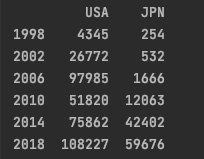
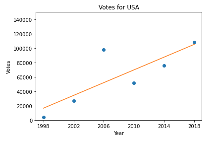
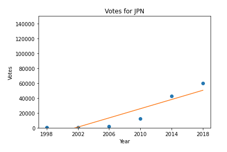

## Team 2: Deliverable 2 - Brazilian Immigrant Participation in Brazil-Held Election Results

## Checklist
- [x] Collect and pre-process a secondary batch of data
- [x] Refine the preliminary analysis of the data performed in PD1
- [x] Answer another key question
- [x] Refine project scope and list of limitations with data and potential risks of achieving project goal
- [x] Submit a PR with the above report and modifications to original proposal

---
## Initial Questions Answered and Results

### Question: How are voting patterns different among Brazilian immigrants residing in different countries (eg, US vs Japan)?

For this deliverable, our team has refined our initial analysis of the data to answer the question of how has voting patterns different among Brazilian immigrants residing in different countries (eg, US vs Japan). 
This in-depth analysis started with preprocessing the municipality names and extracting the country to form a new feature columns in each data set year. With the country data we able to form a dataframe which summed
the votes from United States and Japan in each election year. 

Our resulting dataframe:

The preprocessing stage was especially tedious and difficult since election data year 2018 and 2014 had "municipality name" in city names, then election data year 2010 had city names attached with inaccurate initials 
of their country, lastly for election data years 2006, 2002, and 1998 the "municipality names" were country names except in Portuguese. The conversion to a consistent naming convention was difficult.

We then proceeded to model each country and their summed votes over each year. Here are the example models:

As seen in our modeling, the shift in voting patterns over time for each country is trending upwards. Overall, the voting participation is about twice as high in the US compared to Japan. There was an interesting 
negative correlation in marginal growth from 2006 to 2010 between US and Japan. From 2006 to 2010, the voting participation decreased in the US versus the increase in Japan. This could be due to the financial crisis and
its effects on the different Brazilian residents in each country. The US tends to demographically attract family immigrants while Japan attracted worker visa immigrants. 

---

## Refined Project Proposal

### Title: Brazilian Immigrant Participation in Brazil-Held Election Results

## Team Members
- Chen Feng (cefeng9988)
- Marco Raigoza (marco-raigoza)
- Wangkai Zhu (wzhu8410)
- Jiaru Li (Jiaru-Li)

## Project Description
This project seeks to understand voting patterns of Brazilian immigrants in Brazil elections and the composition of the Brazilian immigrant electorate. By analyzing the election data, we hope to understand changing patterns among Brazilian immigrants that vote in Brazilian elections by analyzing how Brazilians in different countries and social-political activities have influenced voting patterns.

Pending the success of Brazilian data analysis, look at similar patterns and trends for Haitan Immigrants and Haiti-held elections as well as Dominican Republic Immigrants and Dominican Republic-held elections.

Contextual Note: Immigrants living in the US (or outside their home country) can still vote in national elections.

## Data Sets
For our project, we have been given 2 main datasets, each with 6 separate files (excel worksheets). The first dataset contains demographic data on Brazilian immigrant voters for the years 1998, 2002, 2006, 2010, 2014, and 2018. The second dataset contains voting records for Brazilian immigrant voters for the same years.
Our team (Team 2) is working closely with the election data and analyzing voting trends, changes in voting pattern and how voters from different countries vote differently.

## Plan for Data Set Cleaning
At this stage, the main cleaning task will be reconciling pre-2010 datasets with post-2010 datasets as there are missing, incomplete, or inconsistent values across the datasets:

-Prior to 2010, the municipality code (location of voter) feature only identified the country of the voter. However, after 2010, the codes were updated to identify the region within a country of the voter. In order to compare data from all years, we will need to develop a mapping function to reconcile the codes for the pre-2010 and post-2010 datasets.

## Plan for Answering Strategic Questions
To begin, we will clean the datasets. For the voting records dataset, we will look at how voting patterns — popularity of political parties and voter turnout — have changed over time as well as differences in voting patterns between countries the electorate votes from. 

## Key Questions to be Answered
Our team will use the election data to answer as many of the questions below as possible.
- How have voting patterns changed over time
- What are some social-political activities that have influenced voting patterns? Which factors appear to be the most impactful?
- How are voting patterns different among Brazilian immigrants residing in different countries (eg, US vs Japan)?
- How have voting patterns changed over time across all different countries?

## Limitations
- There appears to be some variance in how "location" (or municipality) of voters is defined in the different datasets (for example, the 1998 dataset appears to only identify the countries in which voters live, but later datasets break down this data into major cities/regions within a country). Likely, we should be able to resolve these differences through some data cleaning, but it is worth noting.
- This is very minor, but some of the earlier datasets contain entries from countries which have since been renamed or split into multiple countries (eg, Yugoslavia). We will need to figure out how to deal with these entries as we analyze trends over time.
- We have been advised by the client to avoid making causal inferences, i.e. inferences that aren’t ground in statistical analysis.
- We have been advised by the client that there is limited interest in regression/predictive analyses (only looking at past trends)

## Deliverables
- Final presentation/report describing methodology, trends found in electorate information and trends in voting patterns.
- Visualizations of trends over time

---

# Repo Admin

# Add Users
To add yourself to the repository, open a Pull Request modifying `COLLABORATORS`, entering your GitHub username in a newline.

All Pull Requests must follow the Pull Request Template, with a title formatted like such `[Project Name]: <Descriptive Title>`