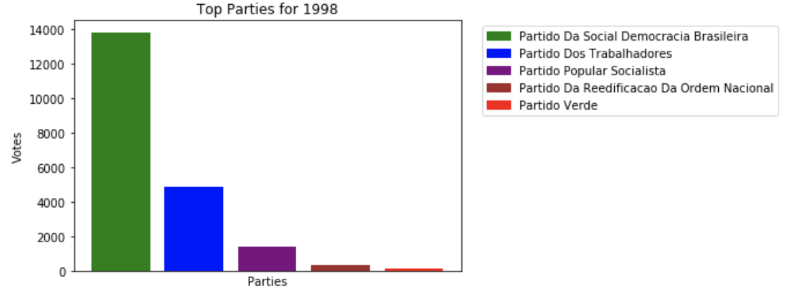
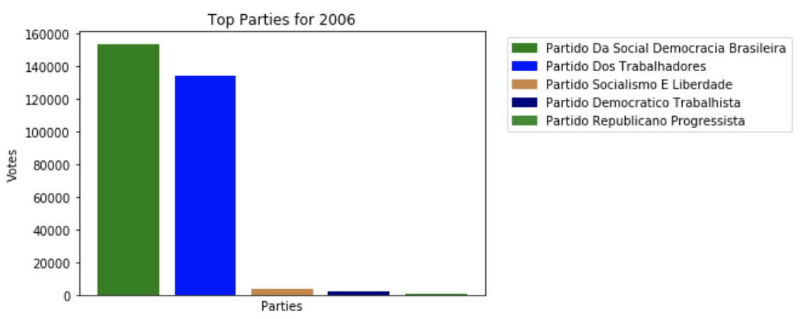
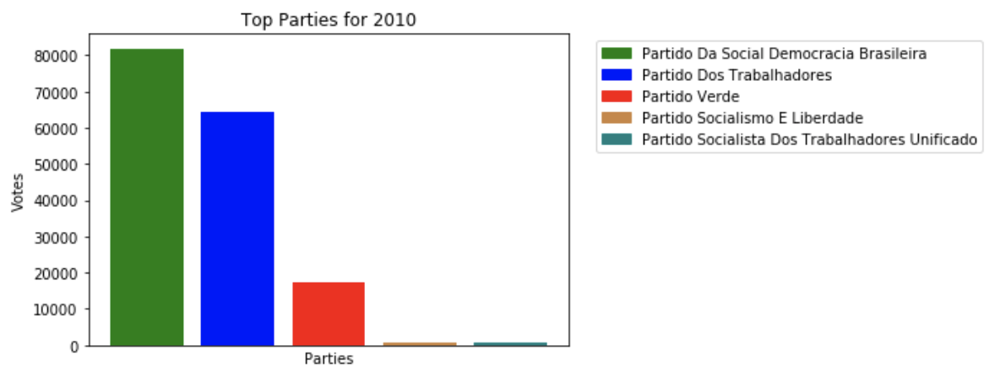
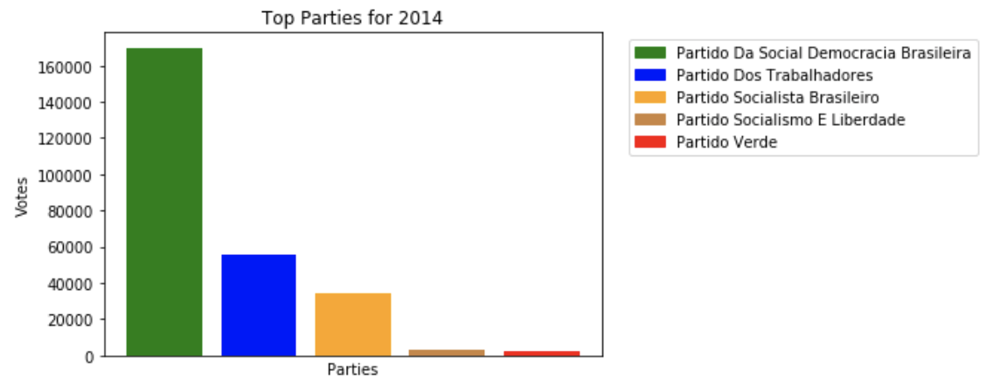
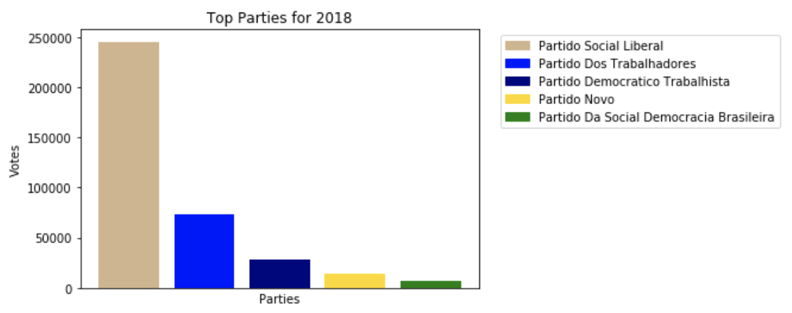

## Team 2: Deliverable 3 - Brazilian Immigrant Participation in Brazil-Held Election Results

## Checklist
- [x] All data is collected
- [x] Refine the preliminary analysis of the data performed in PD1 & 2
- [x] Answer another key question
- [x] Attempt to answer overarching project question
- [x] Create a draft of your final report
- [x] Refine project scope and list of limitations with data and potential risks of achieving project goal
- [x] Submit a PR with the above report and modifications to original proposal

---
## Document Links
* First Draft of Final Report: [Document](https://docs.google.com/document/d/1UlbZXTUHx7HcR5ONZXqrkxYcVryihC_Knry517Y_Ylo/edit?usp=sharing)

---
## Initial Questions Answered and Results

### Data

All of our data has been preprocessed and cleaned. Municipality names and codes have been processed to be consistent 
across years and header names have also been uniformed.

### Question: How have voting turnout changed over time across different political parties?

For this deliverable, our team has refined our initial analysis of the data to answer the question of how has voting turnout changed over time across different political parties.
To answer this question, we modeled the top 5 political parties and their votes for each year. See models below: 

From our models above, the majority of elections from 1998 to 2018 were dominated by two parties: Partido Da Social 
Democracia Brasileira(PSDP) and Partido Dos Trabalhadores(PT). These two parties were in fierce opposition to each other, 
together amassing over half the annual votes. There is an outlier in 2018 where PSDP placed 5th and Partido Social 
Liberal(PSL) placed first. PSL was originally founded by Luciano Bivar in 1998. In 2018, Bivar stepped down and Jair 
Bolsonaro, a former Social Christian politician, eventually became PSL's nominee for the 2018 presidential election, 
exceeding polling forecasts to receive 46% of the popular vote in the first round. Bolsonaro’s immense popularity and 
majority win explains the outlier in election year 2018 and the shift of party nominations.

### Overarching Question: How have voting patterns changed over time

This question is in progress of being answered thoroughly, at the moment our analysis of how voting patterns have changed
over time is a culmination our four key questions combined. Our team set out to answer this question by forming an additional 
four key questions, detailed in our report, to further investigate Brazilian immigrant voting patterns, relevant exogenous 
political variables, and voter turnout for the top political parties from the top voting countries. Our analysis spans 6 
election datasets across two decades and this data is publically available voting data from the BPDA. Our final report will detail 
the initial preprocessing needed to ensure consistencies across the data then dive into the analysis of each key question. 
Finally, the report will conclude by answering the overarching question with the analysis developed through the 4 key questions.

---

## Refined Project Proposal

### Title: Brazilian Immigrant Participation in Brazil-Held Election Results

## Team Members
- Chen Feng (cefeng9988)
- Marco Raigoza (marco-raigoza)
- Wangkai Zhu (wzhu8410)
- Jiaru Li (Jiaru-Li)

## Project Description
This project seeks to understand voting patterns of Brazilian immigrants in Brazil elections and the composition of the Brazilian immigrant electorate. By analyzing the election data, we hope to understand changing patterns among Brazilian immigrants that vote in Brazilian elections by analyzing how Brazilians in different countries and social-political activities have influenced voting patterns.

Pending the success of Brazilian data analysis, look at similar patterns and trends for Haitan Immigrants and Haiti-held elections as well as Dominican Republic Immigrants and Dominican Republic-held elections.

Contextual Note: Immigrants living in the US (or outside their home country) can still vote in national elections.

## Data Sets
For our project, we have been given 2 main datasets, each with 6 separate files (excel worksheets). The first dataset contains demographic data on Brazilian immigrant voters for the years 1998, 2002, 2006, 2010, 2014, and 2018. The second dataset contains voting records for Brazilian immigrant voters for the same years.
Our team (Team 2) is working closely with the election data and analyzing voting trends, changes in voting pattern and how voters from different countries vote differently.

## Plan for Data Set Cleaning
At this stage, the main cleaning task will be reconciling pre-2010 datasets with post-2010 datasets as there are missing, incomplete, or inconsistent values across the datasets:

-Prior to 2010, the municipality code (location of voter) feature only identified the country of the voter. However, after 2010, the codes were updated to identify the region within a country of the voter. In order to compare data from all years, we will need to develop a mapping function to reconcile the codes for the pre-2010 and post-2010 datasets.

## Plan for Answering Strategic Questions
To begin, we will clean the datasets. For the voting records dataset, we will look at how voting patterns — popularity of political parties and voter turnout — have changed over time as well as differences in voting patterns between countries the electorate votes from. 

## Key Questions to be Answered
Our team will use the election data to answer as many of the questions below as possible.
- How have voting patterns changed over time
- What are some social-political activities that have influenced voting patterns? Which factors appear to be the most impactful?
- How are voting patterns different among Brazilian immigrants residing in different countries (eg, US vs Japan)?
- How have voting patterns changed over time across all different countries?

## Limitations
- There appears to be some variance in how "location" (or municipality) of voters is defined in the different datasets (for example, the 1998 dataset appears to only identify the countries in which voters live, but later datasets break down this data into major cities/regions within a country). Likely, we should be able to resolve these differences through some data cleaning, but it is worth noting.
- This is very minor, but some of the earlier datasets contain entries from countries which have since been renamed or split into multiple countries (eg, Yugoslavia). We will need to figure out how to deal with these entries as we analyze trends over time.
- We have been advised by the client to avoid making causal inferences, i.e. inferences that aren’t ground in statistical analysis.
- We have been advised by the client that there is limited interest in regression/predictive analyses (only looking at past trends)

## Deliverables
- Final presentation/report describing methodology, trends found in electorate information and trends in voting patterns.
- Visualizations of trends over time

---

# Repo Admin

# Add Users
To add yourself to the repository, open a Pull Request modifying `COLLABORATORS`, entering your GitHub username in a newline.

All Pull Requests must follow the Pull Request Template, with a title formatted like such `[Project Name]: <Descriptive Title>`