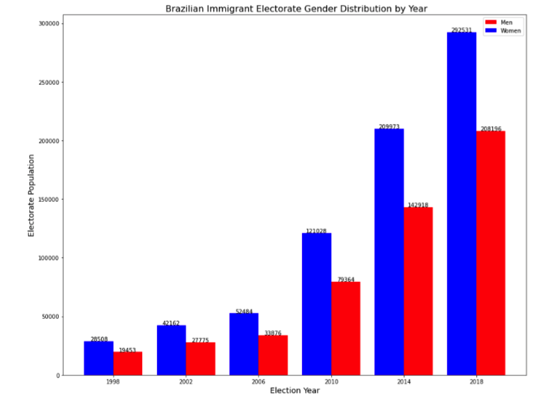
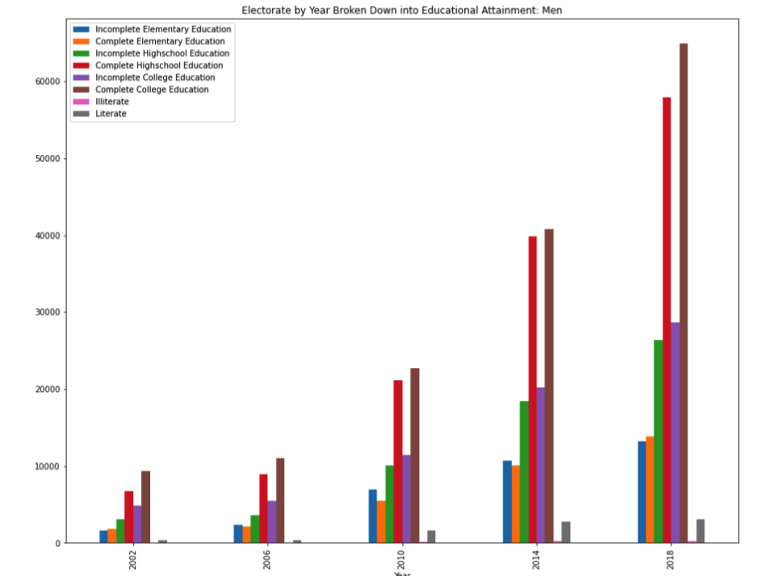

# CS506 - Team 1: Final Deliverables: Brazilian Immigrant Participation in Brazil-Held Elections

## Links to Final Deliverables
Below, we provide links for all final project deliverables as well as the locations of our source code and all visualizations produced through our analysis.
* [Final Project Report](./Final_Report_Team1.pdf)
* [Final Project Presentation](./Final_Presentation_Team1.pdf)
* [Visualizations](./readme_images)
* [Description of Dataset](./README_DataDescription.md)
* [Codebase Description and Instructions for Use](./Code_Description.md)
* [Project Source Code](./src)
* [Project Datasets](./data)

# 1. Table Of Contents
- [1. Table Of Contents](#1-table-of-contents)
- [2. Project Overview](#2-project-overview)
- [3. Overview of Our Dataset](#3-overview-of-our-dataset)
- [4. Overview of Our Codebase](#3-overview-of-our-codebase)
- [5. Getting Started](#5-getting-started)
  - [5.1. Cloning](#51-cloning)
  - [5.2. Requirements](#52-requirements)
  - [5.3. Installing Python Requirements](#53-installing-python-requirements)
  - [5.4. Running our Source Code](#54-running-our-source-code)
- [6. Sample Results](#6-sample-results)

# 2. Project Overview

This repository our code and analysis created created for our CS506 Course Project. Our project sought to understand the composition of the Brazilian immigrant electorate. By analyzing data on the electorate collected for all Brazilian Presidential elections from 1998—2018, we sought to understand changing patterns among Brazilian immigrants that vote in Brazilian elections. After analyzing the electorate, we conducted additional analysis on Brazilian immigrant voting records to try and determine how community and demographic differences may influence voting patterns.

Notably, our Project focused on answering these question for both the Brazilian Immigrant Electorate as a whole as well as for the 10 countries highest populations of Brazilian Immigrants (as of 2018).
 
Contextual Note: Immigrants living in the US (or outside their home country) can still vote in national elections.

# 3. Overview of Our Dataset
For this project, we used two separate data sets. The first was the Brazilian electorate data set (provided by the client), which contains demographic data on Brazilian immigrant voters for the years 1998, 2002, 2006, 2010, 2014, and 2018. The second data set is the election data set, and it contains voting records for Brazilian immigrant voters for the same years.

In addition, we utilized an additional dataset (provided by our client) which estimate the overall populations of the Brazilian Immigrant electorate in all countries around the world for the years 2008, 2011, 2014, and 2020 in order to estimate voter turnout for the years 2006, 2010, 2014, and 2018 respectively.

All data may be found [here](./data) and a detailed description the features in the data may be found [here](./README_DataDescription.md)

# 4. Overview of Our Codebase

A detailed description of our codebase (and instructions for use) can be found [here](./Code_Description.md))

# 5. Getting Started

Here we provide a quick overview on how to get started using the our codebase. 

## 5.1. Cloning

This project may be cloned as follows:

* `git clone git@github.com:BU-Spark/ds-boston-bpda-br-election.git`

## 5.2. Requirements
 - Python3 (We recommened Python `>= 3.7`)
 - Jupyter Notebook
 - Numpy
 - Pandas
 - unidecode

## 5.3. Installing Python Requirements

Python dependencies may be installed as follows:

* `pip install jupyterlab numpy pandas unidecode`

## 5.4. Running our Source Code

We recommend reviewing [our codebase documentation](./Code_Description.md)) for detailed instructions on running our files. 

However, as a quick start, you can simply open the project directory in a jupyter notebook (using `jupyter notebook` from within the `TEAM1/src` folder) and simply run each of the cells in the `electorate_gender.ipynb`, `electorate_location.ipynb`, `top_10_analysis.ipynb`, or `votingdata.ipynb` notebooks.

# 6. Sample Results
Below, we provide a few results produced by our analysis. All visualizations that we generated in our analysis can be found [here](./readme_images), and more detailed analysis can be found in our [final report](./Final_Report_Team1.pdf)

## Sample Analysis - How have Gender and Education Demographics Changed over Time?
*Brazilian Immigrant Electorate Population by Gender*

 

Above, we plot the total number of men and women Brazilian Immigrant Voters by year from years 1998 to 2018. The number of total voters has increased for each dataset analyzed, and the increase is especially notable from 2010 onwards.

* There are consistently more women than men voters, and the disparity between women and men voters increased from 1998 to 2006 before and gradually decreasing to lower than 2006 levels by 2018. 
* Specifically,in 1998, 59% of the voters were women. At the peak disparity in 2006, 60.8% of the voters were women. In 2010, the electorate consisted of 60% women, and ultimately the electorate was 58% women in 2018.

*Brazilian Immigrant Electorate Education Levels (Women)*

 
 Looking into the education levels of female members of the Brazilian Immigrant Election, we can see that individuals with a complete college education and complete high school education are the most prevalent, followed by individuals with an incomplete college education.

 *Brazilian Immigrant Electorate Education Levels (Men)*

 
Similar to our analysis fo female members of the electorate, for male members of the Brazilian Immigrant Election, we can see that individuals with a complete college education and complete education are the most prevalent, followed by individuals with an incomplete college education.
