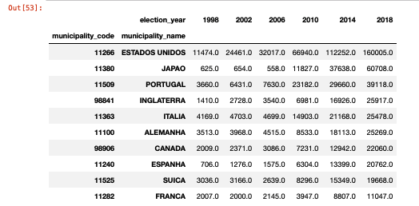
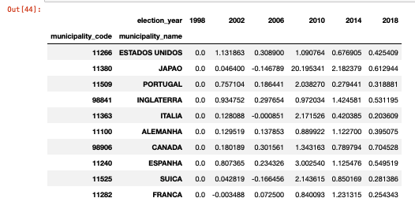
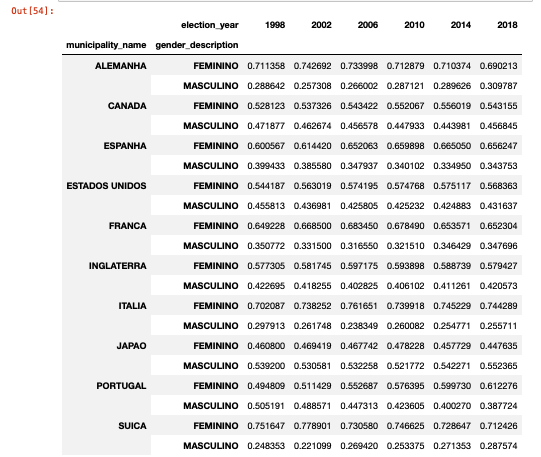
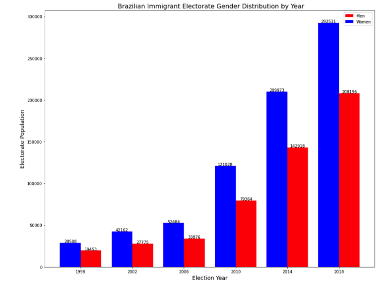
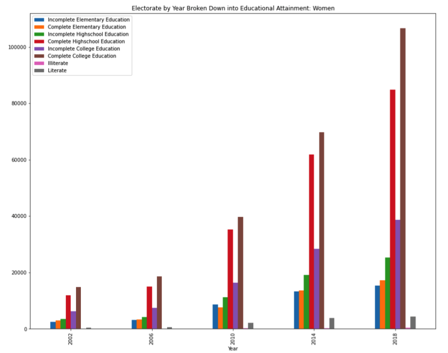
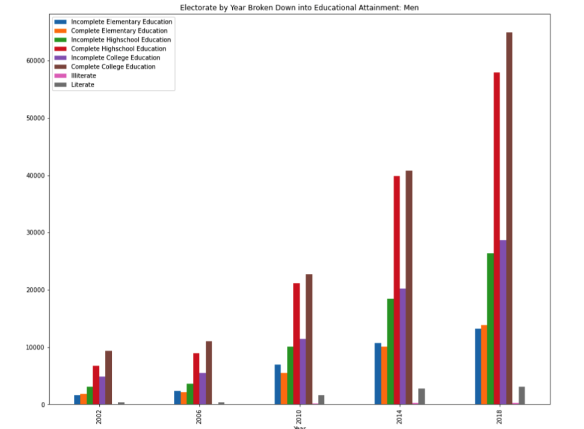

# Team 1 - Deliverable 1 - Brazilian Immigrant Participation in Brazil-Held Election Results

## Checklist
- [x] Collect and pre-process a preliminary batch of data
- [x] Perform a preliminary analysis of the data
- [x] Answer two key questions
- [x] Refine project scope and list of limitations with data and potential risks of achieving project goal
- [x] Submit a PR with the above report and modifications to original proposal

---
## Questions Analyzed and Results

### How are electorate populations different among Brazilian immigrants residing in different countries (eg, US vs Japan)?

For preliminary analysis, we looked into the following:
- How electorate populations differ by size (in terms of countries)
    - Overall the population of Brazilian immigrant voters has been growing since 1998
    - For all datasets since 1998, the United States has remained the country with the highest number of Brazilian Immigrant voters. Italy and Portugal have also been among the top 5 countries every year in the dataset.
    - In 2010, the number of Brazilian immigrant voters in Japan increased 20x, moving it into 4th place among countries with the most Brazilian immigrant voters
- How electorate populations have grown in different countries
    - The top growing countries for Brazilian immigrant voters (as measured by change in population from the prior election year) has varied each year. However, the UAE was the top growing country in both 2014 and 2018. 
- How Gender ratios differ between countries
    - In looking at the aggregate, it was difficult to get a sense of how these ratios differed, so more analysis was done when only looking at the the top 10 countries by population

- How the Brazilian Immigrant electorate in top 10 countries (by population of Brazilian Immigrant voters in 2018) differ?.

*Populations for Top 10 countries by Year*

The top 10 countries by Brazilian Immigrant Electorate Population (as of 2018) were:
* The United States
* Japan
* Portugal
* The United Kingdom
* Italy
* Germany
* Canada
* Spain
* Switzerland
* France
    
 *Electorate Population Growth Rates (from previous election year) for Top 10 countries by Year*
     
  

Above, we can see the growth rates (from the previous election year) for each of the top 10 countries from 1998-2018. Looking at this data, there are a few noticeable trends:
* The Brazilian immigrant population in the United States has grown between every election year, with the largest growth (in terms of population %) occurring between the 1998 and 2002 elections
* As noted above, the Brazilian immigrant population in Japan experienced significant growth between 2006 and 2010, though growth has slowed subsequently since.
* Portugal, UK, USA, Germany, Canada, and Spain have consistently had positive growth rates between all election years analyzed

 *Gender Ratios (as % of Total Population) for Top 10 countries by Year*
     
  

Here, we look at the gender ratios in the top 10 countries over all datasets. A few patterns emerge:
* The Brazilian Immigrant populations in Germany,Italy, and Switzerland are predominately female, with women making up ~70% or more of the Brazilian Immigrant population over all datasets.
* Japan is the only country among the top 10 for which men consistently outnumber women within the Brazilian Immigrant population

### How have gender demographics within the electorate populations changed over time?

*Brazilian Immigrant Electorate Population by Gender*
  

Above, we plot the total number of men and women Brazilian Immigrant Voters by year from years 1998 to 2018. The number of total voters has increased for each dataset analyzed, and the increase is especially notable from 2010 onwards.

* There are consistently more women than men voters, and the disparity between women and men voters increased from 1998 to 2006 before and gradually decreasing to lower than 2006 levels by 2018. 
* Specifically,in 1998, 59% of the voters were women. At the peak disparity in 2006, 60.8% of the voters were women. In 2010, the electorate consisted of 60% women, and ultimately the electorate was 58% women in 2018.

*Brazilian Immigrant Electorate Education Levels (Women)*
 
 
 Looking into the education levels of female members of the Brazilian Immigrant Election, we can see that individuals with a complete college education and complete high school education are the most prevalent, followed by individuals with an incomplete college education.

 *Brazilian Immigrant Electorate Education Levels (Men)*
 
 
Similar to our analysis fo female members of the electorate, for male members of the Brazilian Immigrant Election, we can see that individuals with a complete college education and complete education are the most prevalent, followed by individuals with an incomplete college education.

---

## Refined Project Proposal

### Title: Brazilian Immigrant Participation in Brazil-Held Election Results

[Original Project Description](https://docs.google.com/document/d/10svI0F6vJOUjewvWAV4yx70k0brZGpG6pSurwHtmrUM/edit)

## Team Members
- Wiley Hunt (whunt1965)
- John Bestavros (Johannes2755)
- Jerry Zhang (jzhang12)
- Jenna Peters (jennapeters917)

## Meeting Times
*Bi-Weekly Client Meetings:* Fridays 9-10 AM

*Weekly PM Meetings:* Tuesdays 5:30-6 PM

## Project Description
This project seeks to understand the composition of the Brazilian immigrant electorate. By analyzing data on the electorate collected for all Brazilian Presidential elections from 1998—2018, we hope to understand changing patterns among Brazilian immigrants that vote in Brazilian elections. After analyzing the electorate, we hope to conduct additional analysis on Brazilian immigrant voting records to try and determine how community and demographic differences may influence voting patterns.

Pending the success of Brazilian data analysis, we may also look at similar patterns and trends for Haitan immigrants and Haiti-held elections as well as Dominican Republic immigrants and Dominican Republic-held elections.
 
Contextual Note: Immigrants living in the US (or outside their home country) can still vote in national elections.

## Data Sets
For this project, we will primarily focus on the Brazilian electorate dataset, which contains demographic data on Brazilian immigrant voters for the years 1998, 2002, 2006, 2010, 2014, and 2018. The second dataset is the election dataset and it contains voting records for Brazilian immigrant voters for the same years. Our team (team one) will primarily work with the electorate dataset, while team two will do their project primarily focusing on the election dataset. However, after analyzing the electorate, we do plan to examine the election dataset in order to explore how voting patterns may relate to the demographics trends that we have uncovered. 

## Plan for Data Set Cleaning
At this stage, the main cleaning task will be reconciling pre-2010 datasets with post-2010 datasets as there are missing, incomplete, or inconsistent values across the datasets:

- Prior to 2010, the municipality code (location of voter) feature only identified the country of the voter. However, after 2010, the codes were updated to identify the region within a country of the voter. In order to compare data from all years, we will need to develop a mapping function to reconcile the codes for the pre-2010 and post-2010 datasets. 
- From 2002 until 2010, there is an attribute “educational attainment code” numerically representing education level along with an “educational description”. However in 2010 and 2018, this attribute is no longer available and we are left with just an education description. We will need to use past data and their numerical assignments to education description to map this attribute to 2010 and 2018 electorate datasets.
- A good portion of the datasets have some columns with completely missing data (ie. marital status description and code), ranging from a numerical representation to show the lack of data to the words “no information”. We will need to standardize the absence of data across all sets and columns.
- For 2010 and 2018, there is a representation of age group for the electorate, which is just a string specifying cohort. The past datasets have a “age group code” which is -3 for all data entries, signifying it is unavailable information. We can repurpose this attribute, “age group code” to create a numeric code for age groups in 2010 and 2018, making it easier to analyze the data. 
- The Year attribute for data points needs to be converted into a Datetime object once we read in our data.

## Plan for Answering Strategic Questions
To begin, we will clean the electorate dataset. Then, we will look at how the composition of the electorate populations have changed over time as well as differences in electorate populations between countries. Looking at age, gender and education of the electorate across the dataset will help provide this insight. After analyzing the electorate, we will examine the Brazilian immigrant voting dataset in order to answer additional questions relating electorate (demographic) information with voting patterns.

## Key Questions to be Answered
- How are electorate populations different among Brazilian immigrants residing in different countries (eg, US vs Japan)?
- How have gender demographics within the electorate populations changed over time?
- How have education-level gender demographics within the electorate populations changed over time?
- How have voting trends changed as the demographics of the electorate (voters) have changed?
- How do communal factors—the environment of immigrant communities in different countries—impact voting patterns?
- How does the intersection of gender and education level impact voting patterns?

## Limitations
- Looking at the data set, it appears that new features (e.g. age, marital status, etc) have been added over time. Thus, the features present in each of the datasets may vary by year, which may make it difficult to analyze how these features have changed over time.
- There appears to be some variance in how "location" (or municipality) of voters is defined in the different datasets (for example, the 1998 dataset appears to only identify the countries in which voters live, but later datasets break down this data into major cities/regions within a country). Likely, we should be able to resolve these differences through some data cleaning, but it is worth noting.
- This is very minor, but some of the earlier datasets contain entries from countries which have since been renamed or split into multiple countries (eg, Yugoslavia). We will need to figure out how to deal with these entries as we analyze trends over time.
- Our client had mentioned that there would be some interest in analyzing what proportion of the populations vote in each country (when compared to the total immigrant population in the country). However, the datasets provided only cover 1 year in our dataset (2014). We may be able to use total population numbers for other years close to a desired year to to approximate the population. For example, we can use 2020 (which we do have) to approximate these proportions for our 2018 dataset.

## Deliverables
- Final presentation/report describing methodology and trends found surrounding electorate demographics and voting patterns. 
- Visualizations of these trends (and how they change over time)

