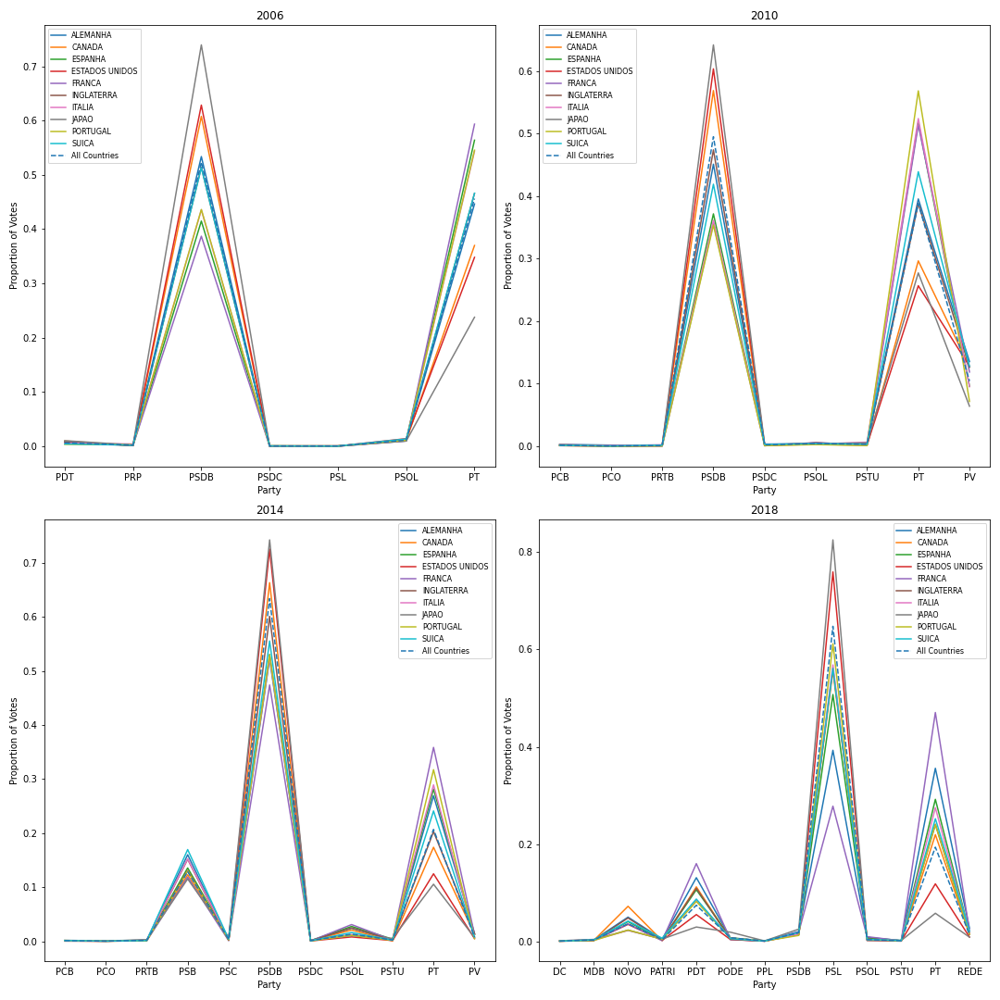

# Team 1 - Deliverable 3 - Brazilian Immigrant Participation in Brazil-Held Election Results

## Checklist
- [x] All data is collected
- [x] Refine the preliminary analysis of the data performed in PD1 & 2
- [x] Answer another key question
- [x] Attempt to answer overarching project question
- [x] Create a draft of your final report
- [x] Refine project scope and list of limitations with data and potential risks of achieving project goal
- [x] Submit a PR with the above report and modifications to original proposal

---
## Questions Analyzed and Results

### How Have Voting Patterns Changed Over Time (Further Analysis)? 
(See [Voting Analysis](https://github.com/BU-Spark/ds-boston-bpda-br-election/blob/team1-deliverable-2/TEAM1/src/votingdata.ipynb) for more Detail)

#### Voting for Political Parties - Top 10 Countries
Building on our previous analysis, we decided to compare the voting patterns of the top 10 countries to the average in the entire dataset. To do this, we switched from looking at raw numbers (total number of votes) to looking at proportions (the percentage of the total vote received by each political party) for both the top 10 countries and the dataset as a whole.

*Popularity of Political Parties in Top 10 countries- 2006-2018*

Above, we can see the proportion of votes received by each party among the top 10 countries (and the entire dataset) for the 2006, 2010, 2014, and 2018 elections. 

* One interesting pattern that emerges across all years is that the general shape of the voting patterns among the top 10 countries is roughly the same as the aggregate dataset (ie, the most popular parties among the top 10 countries are also the most popular parties among the aggregate dataset). 
* In 2006, 2010, and 2014, Japan, the US, and Canada have a higher proportion of votes for the PSDB than the dataset average and the other countries have a higher proportion of votes for the PT.
* In 2018, we can see that 8 out of the 10 top 10 countrues had a higher proportion of votes for the PDT  and PT (and lower proportion for the PSL) than the dataset average. Meanwhile, voters in Japan and the US were the opposite, with a higher proportion of votes for the PSL (and lower proportion for the PT and PDT) than the dataset average.

### Percentage of the Population that Votes in Top 10 Countries
Below, we analyze the proportion of the electorate which votes in our top 10 countries for the years 2006 to 2018. Our estimations for the total size of the populations in 2006, 2010, and 2018 are based on data available on the size of these populations in 2008, 2011, and 2020 respectively.

Above, we plot the percentage of the electorate population which voted in rounds 1 and 2 of the 2006-2018 elections. There are a few key trends which immediately emerge:
* Overall, the percentage of the population which votes has been less than 20% in all years (except for in Canada, which had over 25% of its population vote in both round in 2006). 
* In the US, England, and Spain, the percentage of the population which voted around or less than 5% across all years analyzed.
* Voting in Japan (as a % of total population) has been increased in all years, with Japan having the highest percentage of voters (out of total population) in 2018.

---

### How does Age Differ among Top 10 Countries?
*John to Add*

---

## Refined Project Proposal

### Title: Brazilian Immigrant Participation in Brazil-Held Election Results

[Original Project Description](https://docs.google.com/document/d/10svI0F6vJOUjewvWAV4yx70k0brZGpG6pSurwHtmrUM/edit)

## Team Members
- Wiley Hunt (whunt1965)
- John Bestavros (Johannes2755)
- Jerry Zhang (jzhang12)
- Jenna Peters (jennapeters917)

## Meeting Times
*Bi-Weekly Client Meetings:* Fridays 9-10 AM

*Weekly PM Meetings:* Tuesdays 5:30-6 PM

## Project Description
This project seeks to understand the composition of the Brazilian immigrant electorate. By analyzing data on the electorate collected for all Brazilian Presidential elections from 1998—2018, we hope to understand changing patterns among Brazilian immigrants that vote in Brazilian elections. After analyzing the electorate, we hope to conduct additional analysis on Brazilian immigrant voting records to try and determine how community and demographic differences may influence voting patterns.

Pending the success of Brazilian data analysis, we may also look at similar patterns and trends for Haitan immigrants and Haiti-held elections as well as Dominican Republic immigrants and Dominican Republic-held elections.
 
Contextual Note: Immigrants living in the US (or outside their home country) can still vote in national elections.

## Data Sets
For this project, we will primarily focus on the Brazilian electorate dataset, which contains demographic data on Brazilian immigrant voters for the years 1998, 2002, 2006, 2010, 2014, and 2018. The second dataset is the election dataset and it contains voting records for Brazilian immigrant voters for the same years. Our team (team one) will primarily work with the electorate dataset, while team two will do their project primarily focusing on the election dataset. However, after analyzing the electorate, we do plan to examine the election dataset in order to explore how voting patterns may relate to the demographics trends that we have uncovered. 

## Plan for Data Set Cleaning
At this stage, the main cleaning task will be reconciling pre-2010 datasets with post-2010 datasets as there are missing, incomplete, or inconsistent values across the datasets:

- Prior to 2010, the municipality code (location of voter) feature only identified the country of the voter. However, after 2010, the codes were updated to identify the region within a country of the voter. In order to compare data from all years, we will need to develop a mapping function to reconcile the codes for the pre-2010 and post-2010 datasets. 
- From 2002 until 2010, there is an attribute “educational attainment code” numerically representing education level along with an “educational description”. However in 2010 and 2018, this attribute is no longer available and we are left with just an education description. We will need to use past data and their numerical assignments to education description to map this attribute to 2010 and 2018 electorate datasets.
- A good portion of the datasets have some columns with completely missing data (ie. marital status description and code), ranging from a numerical representation to show the lack of data to the words “no information”. We will need to standardize the absence of data across all sets and columns.
- For 2010 and 2018, there is a representation of age group for the electorate, which is just a string specifying cohort. The past datasets have a “age group code” which is -3 for all data entries, signifying it is unavailable information. We can repurpose this attribute, “age group code” to create a numeric code for age groups in 2010 and 2018, making it easier to analyze the data. 
- The Year attribute for data points needs to be converted into a Datetime object once we read in our data.

## Plan for Answering Strategic Questions
To begin, we will clean the electorate dataset. Then, we will look at how the composition of the electorate populations have changed over time as well as differences in electorate populations between countries. Looking at age, gender and education of the electorate across the dataset will help provide this insight. After analyzing the electorate, we will examine the Brazilian immigrant voting dataset in order to answer additional questions relating electorate (demographic) information with voting patterns.

## Key Questions to be Answered
- How are electorate populations different among Brazilian immigrants residing in different countries (eg, US vs Japan)?
- How have gender demographics within the electorate populations changed over time?
- How have education-level gender demographics within the electorate populations changed over time?
- How have voting trends changed as the demographics of the electorate (voters) have changed?
- How do communal factors—the environment of immigrant communities in different countries—impact voting patterns?
- How does the intersection of gender and education level impact voting patterns?

## Limitations
- Looking at the data set, it appears that new features (e.g. age, marital status, etc) have been added over time. Thus, the features present in each of the datasets may vary by year, which may make it difficult to analyze how these features have changed over time.
- There appears to be some variance in how "location" (or municipality) of voters is defined in the different datasets (for example, the 1998 dataset appears to only identify the countries in which voters live, but later datasets break down this data into major cities/regions within a country). Likely, we should be able to resolve these differences through some data cleaning, but it is worth noting.
- This is very minor, but some of the earlier datasets contain entries from countries which have since been renamed or split into multiple countries (eg, Yugoslavia). We will need to figure out how to deal with these entries as we analyze trends over time.
- Our client had mentioned that there would be some interest in analyzing what proportion of the populations vote in each country (when compared to the total immigrant population in the country). However, the datasets provided only cover 1 year in our dataset (2014). We may be able to use total population numbers for other years close to a desired year to to approximate the population. For example, we can use 2020 (which we do have) to approximate these proportions for our 2018 dataset.

## Deliverables
- Final presentation/report describing methodology and trends found surrounding electorate demographics and voting patterns. 
- Visualizations of these trends (and how they change over time)

